# MiniJS8

A standalone JS8Call transceiver application for the Raspberry Pi Zero 2W. JS8 protocol over HF, with a 240×240 display, two-button navigation, GPS, and an SQLite-backed mailbox — no laptop required.

**Version:** 1.0.0 · **Platform:** Raspberry Pi Zero 2W (Pi OS Bookworm) · **License:** Proprietary

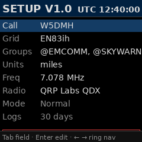

---

## What it is

MiniJS8 is a complete JS8 transceiver controller. Plug in a supported radio + an audio interface, give it 5 V on the USB port, configure your callsign, and you're on the air. The application handles JS8 decoding and encoding, multi-frame message reassembly, the JS8 mailbox protocol (QUERY MSGS / MSG ID delivery), heartbeats, group memberships with auto-respond, GPS location, and an emergency SOS mode.

Everything runs locally on the Pi. No internet connection required for operation — only for time sync (chrony) and software updates.

## Who it's for

- **Field operators** who want a small, headless JS8 station they can take camping, deploy at a Field Day site, or carry in a go-kit
- **EmComm volunteers** who need a reliable, simple-to-train-on device for group nets (@EMCOMM / @SKYWARN / @ARES)
- **Newcomers to digital modes** who find a full PC + JS8Call install intimidating
- **Experienced JS8 operators** who want a second station for monitoring a group or running a mailbox node

---

## Quick start

### 1. Boot the device

Power the Pi via the USB-C jack with a 5 V / ≥1 A supply. First boot takes ~30 seconds; the HOME screen appears when the modem is ready.

### 2. Open SETUP

Press the **right arrow** button to cycle through the screen ring until you reach SETUP.


### 3. Configure your station

Use **TAB** (right button) to move between fields and **ENTER** (left button) to begin editing. For each field, type your value and press ENTER to save, or ESC to cancel.

| Field | What to enter | Example |
|---|---|---|
| **Call** | Your callsign | `W5DMH` |
| **Grid** | Your Maidenhead 4- or 6-character grid | `EN83ih` |
| **Groups** | Comma-separated JS8Call groups you want to join (optional) | `@EMCOMM, @SKYWARN` |
| **Units** | `miles` or `km` for distance display | `miles` |
| **Freq** | VFO frequency in MHz | `7.078` |
| **Radio** | Press ENTER to cycle through supported radio profiles | `QRP Labs QDX` |

Once Call and Grid are set, TX is unlocked automatically. If you need to transmit before configuring (life-safety emergency), see **Emergency bypass** below.

### 4. Plug in GPS (optional but recommended)

A u-blox 7 USB GPS dongle in `/dev/ttyACM0` (or wherever gpsd finds it) gets you accurate time and an auto-derived grid for the EMERGENCY screen. The HOME screen's GPS row will go green within 30–90 seconds of an open-sky fix.

### 5. Make your first contact

Press the left arrow to cycle to **ALLCALL** and pick **CQ**. The station transmits `W5DMH: @ALLCALL CQ <grid>` in the next slot. Anyone who decodes you and presses Enter on your row will land their reply in your **INBOX** (UNREAD) and on your **DIRECTED** chat log.

For directed messages, go to **COMPOSE**, enter the destination callsign in TO, leave CMD on MSG, type your text in TEXT, and press SEND.

---

## Screens

The screen ring (left/right arrows cycle):

`HOME → HEARD → DIRECTED → INBOX → COMPOSE → ALLCALL → DIRECTED_MENU → EMERGENCY → SETUP`

INBOX_DETAIL and SHUTTING_DOWN aren't part of the ring — they're entered via specific actions (Enter on an inbox row, or holding both buttons).

### HOME

The dashboard. Shows your callsign, grid, GPS state, current VFO frequency, CAT connection state, decode mode, and heartbeat-beacon state.

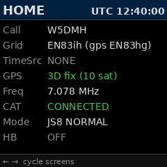

`Grid` shows your configured grid first, with the GPS-derived grid in parentheses when available — handy for spotting drift between your stored grid and where you actually are. `GPS: 3D fix (10 sat)` means a usable fix; `acquiring (N sat)` in amber means GPS hasn't locked yet. `CAT: CONNECTED` confirms the radio is responding to commands; if it shows `disconnected`, check your USB cable. `HB` displays the current heartbeat mode (OFF, 15 min, 30 min) — cycle from the ALLCALL screen.

### HEARD

A live list of stations recently decoded, sorted by recency, with their SNR, grid, distance from you (miles or km per your Units setting), and bearing.

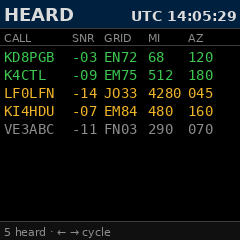

Rows are colour-coded by how recently each station was heard:

| Colour | Age | Meaning |
|---|---|---|
| **Green** | < 30 minutes | Active — station was on the air within the last half-hour |
| **Yellow** | 30 min – 4 h | Recent — useful for "I heard them earlier today" reference |
| **Grey** | > 4 hours | Stale — station hasn't been on for a while; propagation may have closed |

Use this to gauge propagation, pick a callsign to direct a message to (see COMPOSE), or check whether your CQ is being received. The distance and bearing columns compute from your configured grid; if you don't have a grid set, they show blank. The list holds up to 50 stations — newest at the top, older entries fade through yellow into grey rather than disappearing, so you can still see who was on the band earlier in the session.

### DIRECTED

The chronological chat log of protocol exchanges involving your station. Outbound transmissions are red, inbound are white (or amber for group messages addressed to a group you're in).

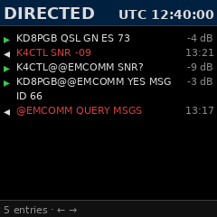

Group-addressed traffic shows as `K4CTL@@EMCOMM` — the double-`@` reads as "K4CTL speaking to the @EMCOMM group". You see at a glance whether something was a personal directed message or a group blast. Multi-frame messages are reassembled and shown as one row; the same row updates as continuation frames arrive (you won't see "YES" twice followed by "YES MSG ID 66" — just the final assembled body).

The log is an in-memory ring buffer (last ~50 entries). For persistent history, MSG content lands in INBOX.

### INBOX

The mailbox. Combines incoming mail addressed to you (UNREAD in white, READ in dim grey) with held STORE rows (mail you're holding for delivery to other stations via QUERY MSGS, rendered in amber with a `→RECIPIENT` label).

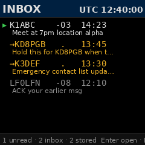

The footer summarises counts: `1 unread · 2 inbox · 2 stored`. Up/Down to navigate, Enter to open a detail view, Del to remove the focused row. Held STORE rows are served automatically when their recipient sends `QUERY MSGS` — you don't have to do anything.

### INBOX_DETAIL

Full-text view of one inbox or STORE row.

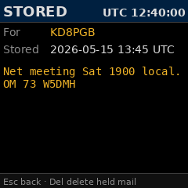

STORE-row detail (shown above) renders in amber with `For:` / `Stored:` fields; inbound mail renders in white with `From:` / `At:` / `SNR:`. Press Del here to delete the row from the database and return to the list — useful for clearing held STOREs you no longer want.

### COMPOSE

The outbound-message editor.

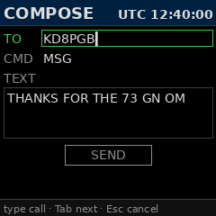

`TO` is the destination — a callsign (`KD8PGB`) or a group (`@EMCOMM`). The Up/Down arrows on TO cycle through stations from your Heard list plus your configured groups, alphabetical for predictable navigation. `CMD` is the protocol verb — MSG, QUERY MSGS, SNR?, GRID?, INFO, STORE, MYLOC, and a few others — cycle with Up/Down on that field. `TEXT` is the message body, auto-uppercased. Press SEND to queue the wire string for the next TX slot.

For messages to a group (e.g. `@EMCOMM MSG <body>`), MiniJS8 sends once and marks the transmission DELIVERED — no retransmit loop, since no single station's ACK can close the loop on a group blast. Personal MSGs (`K1ABC MSG <body>`) wait for the recipient's auto-ACK and retransmit if it doesn't arrive.

### ALLCALL

Broadcast actions: heartbeat-beacon mode, mailbox-poll, and CQ.

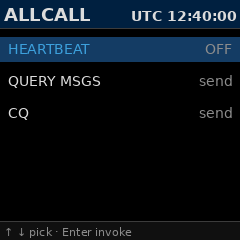

`HEARTBEAT` cycles between OFF, every 15 min, and every 30 min. With a non-OFF setting the station transmits `@HB HEARTBEAT <grid>` automatically on a randomised slot within each interval — other stations can see you're alive and your grid. `QUERY MSGS` polls `@ALLCALL` asking if anyone is holding mail for you. `CQ` transmits `@ALLCALL CQ <grid>` to invite contacts.

### DIRECTED_MENU

A quick-action menu for directed protocol verbs.

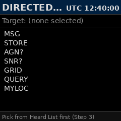

After picking a target callsign from the Heard list (Step 3 of the spec), you can fire MSG / STORE / AGN? / SNR? / GRID / QUERY / MYLOC at them in one or two button presses. It's a faster path than COMPOSE when you know exactly what verb you want.

### EMERGENCY

Operator-triggered SOS mode.

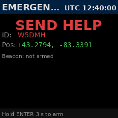

Hold ENTER for 3 seconds to arm. Armed mode transmits `@ALLCALL SOS <lat> <lon>` repeatedly with a randomised slot delay, using your live GPS position when available (or your configured grid as fallback). Designed for life-safety situations — works even on an unconfigured station via Setup's emergency bypass option. The button-hold timer prevents accidental activation.

### SETUP

Station configuration (see Quick Start above).


The `V1.0` in the title bar shows the running firmware version — handy when comparing notes with another operator or filing a forum post. Edit each field with Enter, type your value, Enter again to save. Invalid input (a bad callsign, a malformed group name, or an unsupported units value) shows an amber warning and keeps the edit open so you can correct without losing what you typed. Settings persist atomically to `/var/minijs8/config.toml` — a power loss mid-write leaves either the old config or the new one intact, never a half file.

### SHUTTING_DOWN

The clean-shutdown countdown.

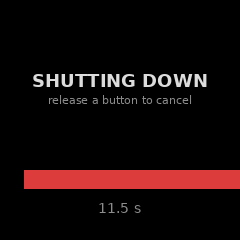

Two ways to trigger it:

- **Hardware**: hold both PiTFT buttons for 5 seconds. The screen switches as soon as both are pressed; release either button before the countdown ends to cancel.
- **Keyboard (USB or SSH)**: press **Ctrl-X** from any screen. The 5-second countdown begins immediately. Press **Esc** (or Ctrl-C) to cancel.

Either path runs through the same code, so the experience is identical — the progress bar drains over 5 seconds and then the Pi runs a graceful systemd shutdown, closing the SQLite databases cleanly and flushing the config file. The countdown bar lets you back out if you triggered it by accident.

Ctrl-X works even on an unconfigured station — power-off is a life-cycle gesture, not a TX-gated action, so an operator without a callsign set can still cleanly turn the device off.

---

## Features

### JS8Call protocol

MiniJS8 speaks the same wire protocol as the JS8Call desktop application. Decode and encode happen in a dedicated modem process (gfsk8) running alongside the Python app. Single-frame and multi-frame messages, directed and group-addressed traffic, all the standard verbs (MSG, MSG TO:, QUERY MSGS, QUERY MSG <id>, SNR?, GRID?, INFO, CQ, ACK, HEARTBEAT, SOS) are supported. Three submode speeds — Slow, Normal, and Fast — share the same protocol grammar; the UI shows your current speed in the HOME `Mode` row.

### Heartbeat beacon

The HOME `HB` row reflects the current heartbeat-beacon mode. Set from the ALLCALL screen. When enabled, the station automatically transmits `@HB HEARTBEAT <grid>` at the chosen interval with a randomised within-interval slot offset so multiple heartbeat stations don't collide on the same minute. Other stations decoding your heartbeat see you in their Heard list with your current grid — useful for "I'm still here and where I said I'd be" net check-ins.

### DIRECTED chat log

An in-memory ring buffer of the last ~50 protocol exchanges your station was involved in. Inbound and outbound rows interleave chronologically (newest at top). Multi-frame reassembly is handled transparently — you see the final assembled body once, not the first frame followed by extensions. Group-addressed traffic is tagged `K4CTL@@EMCOMM` so the operator can see at a glance which transmissions were group blasts versus personal messages. Lost on power-off (it's volatile); INBOX is the persistent log for actual mail content.

### Mailbox (INBOX + persistent SQLite)

The INBOX screen reads from `/var/minijs8/inbox.db`, an SQLite database that holds UNREAD, READ, STORE, and DELIVERED rows. UNREAD/READ rows are mail addressed to you (the bodies of `MSG` deliveries land here, not the DIRECTED log). STORE rows are mail you're holding for others. The database survives power cycles, system restarts, and config changes. A 30-day retention policy sweeps DELIVERED rows older than the threshold so the database doesn't grow unbounded.

### Local STORE (held mail)

Hold a message locally for delivery when a specific station comes on. Use the STORE compose command with a personal-callsign target — when that station transmits `QUERY MSGS`, MiniJS8 automatically replies with `<asker> MSG <id>` and serves the body on their follow-up `QUERY MSG <id>`. STORE targets must be a single callsign (group destinations are rejected with an amber warning — the protocol has no semantics for "deliver this to one of several group members"). Held mail is visible in INBOX as amber `→RECIPIENT` rows and can be deleted from the detail view if it's no longer needed.

### JS8Call groups

Configure up to 4 group memberships in Setup. When a station transmits `K1ABC: @EMCOMM <body>` and you're a member of `@EMCOMM`, the frame is treated like a personal directed message — logged in DIRECTED with the group tag, body addressed to you. Group names follow the JS8Call convention: `@` prefix, 1-8 uppercase alphanumeric characters with optional slashes (`@EMCOMM`, `@DX/NA`, `@REGION/1`). `@ALLCALL` and `@HB` are universal and implicit — every station is in them and they don't need to be listed.

### Group auto-respond

When a group you're a member of receives a `SNR?` or `GRID?` query, MiniJS8 automatically transmits the answer back to the asker after a randomised 0–30 second delay. The delay spreads replies from group members across multiple slots so 10 stations don't all transmit in the same window. `SNR?` reports your signal-to-noise of the asker's frame; `GRID?` reports your configured grid. Other group query verbs (`INFO?`, `HEARING?`, `AGN?`) are out of scope in V1.0 and answered manually if at all.

### GPS integration

A USB GPS dongle plugged into the Pi feeds the application via `gpsd`. The HOME screen shows fix state and satellite count; the EMERGENCY screen shows your decimal-degree position; the GPS-derived grid appears in parentheses on the HOME `Grid` row when present. MiniJS8 includes a workaround for a known `gpsd 3.22 + u-blox 7 PROTVER 14.00` bug where TPV records report `lat=0, lon=0` despite the receiver computing valid ECEF coordinates — when this condition is detected the application converts ECEF to lat/lon itself using the Bowring 1976 closed-form algorithm, accurate to within a few metres.

### Emergency mode

Hold ENTER on the EMERGENCY screen for 3 seconds to arm an SOS broadcast. Once armed, the station transmits `@ALLCALL SOS <lat> <lon>` with a randomised slot delay, using live GPS coordinates when available or your configured grid as fallback. Emergency mode works even on a station that hasn't been configured with a callsign (the "emergency bypass" toggle in Setup unlocks TX for SOS only). The button-hold timer and explicit screen prevent accidental activation.

### Radio control (CAT)

MiniJS8 supports three radio backends, selected from the Setup screen's Radio row:

- **QRP Labs QDX** — full CAT: PTT, VFO frequency, transmit power level. The application takes over the QDX entirely. Connects via the QDX's USB audio + CAT-over-USB combined interface.
- **DigiRig + Xiegu G90 (or compatible Yaesu CAT)** — full CAT via the DigiRig's serial port; audio via the DigiRig sound card. PTT is handled by CAT commands.
- **DigiRig + RTS-only PTT** — for radios with no CAT or unsupported CAT, like Baofeng UV-5R, Quansheng UV-K5, or (tr)uSDX. The DigiRig asserts PTT via RTS line; audio rides the sound card. Frequency is controlled manually at the radio — MiniJS8 shows the operator's last-set frequency in the HOME row but cannot change it.

Switch backends from Setup → Radio → ENTER. The daemon restarts cleanly on change.

### Heard list with distance/bearing

Every decoded frame's sender callsign goes into a recency-sorted Heard list (visible on the HEARD screen). Each entry shows SNR, grid (extracted from the frame's body or the sender's recent HEARTBEAT), distance and bearing from your configured grid, and time since last heard. The list updates live and ages entries out after 30 minutes. Useful both for picking targets in COMPOSE and for getting a feel for current propagation.

### Atomic config save

Settings written via Setup land in `/var/minijs8/config.toml` through an atomic write-then-rename pattern: writes go to `config.toml.tmp`, fsync, then `rename()` over the target. A power loss during the write leaves either the old config or the new one intact, never a half-file. All Setup field edits go through the same validator that rejects malformed input — bad callsigns, malformed group names, unsupported units — with an amber warning so the operator can correct without losing what they typed.

### Time synchronisation

The Pi uses `chrony` to discipline its clock to either a GPS time source (PPS-aware, when GPS is connected) or NTP over the internet (when WiFi/Ethernet is available). The HOME `TimeSrc` row reports the current source. JS8 frame alignment requires sub-second timing — MiniJS8 will refuse to TX when chrony reports the clock as untrusted, surfacing the issue rather than blindly transmitting at the wrong slot. The DIRECTED log decode timestamps come from the disciplined clock; you can trust the slot alignment of every entry.

### Self-echo filter

A defensive filter in the decode path drops any frame whose sender callsign matches your own — preventing TX→RX bleed, audio cable crosstalk, or an over-the-air relay station from re-broadcasting our own transmissions back into the DIRECTED log as if they were inbound. The gfsk8 modem applies a similar filter on raw decoded text (AUTO_REMOVE_MYCALL); the app-level filter is belt-and-braces for group-prefix transmissions that occasionally slip through the modem's text-pattern check.

---

## Hardware

### Bill of Materials

| Item | Notes |
|---|---|
| Raspberry Pi Zero 2W | The reference platform. Pi 3/4/5 work too but are overkill |
| 240×240 ST7789 SPI display | 1.3″ or 1.54″ form factor. Drives via SPI |
| Two momentary push-buttons | Left (back/cancel) + Right (forward/cycle). Wire to two GPIOs |
| USB GPS dongle | u-blox 7 chipset confirmed working; u-blox 8 should work too. NMEA over USB-serial via `gpsd` |
| Micro-USB OTG splitter | Pi Zero has one USB port; you'll want a hub or splitter for radio + GPS simultaneously |
| 5 V / ≥1 A USB-C power | The Pi Zero 2W's USB-C input. Powered via radio's USB or a battery pack for portable ops |
| MicroSD card | 16 GB minimum, Class 10 or better. Pi OS Bookworm Lite (32-bit) |

### Radio interface options

Three supported configurations, picked in Setup → Radio:

**Option A — QRP Labs QDX**
- 4-band CW/digi transceiver, USB audio + USB CAT on one cable
- Full CAT control: PTT, VFO frequency, output power
- The simplest setup — one USB cable from Pi to QDX
- Tested on the W5DMH bench across 40m/30m/20m/17m

**Option B — DigiRig + Xiegu G90**
- DigiRig (Mini or Mobile) provides isolated audio + serial CAT
- G90 connects to DigiRig via its DATA port; DigiRig connects to Pi via USB
- Full CAT: PTT via CAT command, frequency control, power level
- Configure the DigiRig serial port as the radio backend; baud and pinout follow the standard DigiRig wiring

**Option C — DigiRig + RTS-only PTT (Baofeng / Quansheng / (tr)uSDX / etc)**
- For radios with no CAT or unsupported CAT
- DigiRig provides audio + asserts PTT via the serial RTS line
- Frequency is set manually at the radio — MiniJS8 displays the operator's last-known frequency in the HOME row but cannot change it
- Tested with Baofeng UV-5R via the DigiRig's TRRS audio adapter. Should work with Quansheng UV-K5 and (tr)uSDX via the appropriate DigiRig cable
- Note: with RTS-only PTT, the operator is responsible for ensuring the radio is on the correct frequency before TX

---

## SSH access

SSH is **enabled by default** on every MiniJS8 image, so you can drop straight into the Pi from another machine on the same network — no first-boot configuration required.

### Default credentials

| Field | Value |
|---|---|
| **Username** | `pi` |
| **Password** | `minijs8setup` |

Change the password on first login if the device will be reachable from a network you don't fully control:

```bash
ssh pi@minijs8.local
passwd
```

### Connect

```bash
ssh pi@minijs8.local        # or the Pi's IP address
# password: minijs8setup
```

`minijs8.local` resolves via mDNS / Bonjour on most modern OSes. If your network blocks mDNS, find the Pi's IP from your router's DHCP table or by checking the HOME screen (which can be shown over SSH; see below).

### Useful commands

```bash
# Live application log
sudo journalctl -u minijs8 -f

# Filter for specific events
sudo journalctl -u minijs8 -f | grep -E "auto-respond|self-echo|gpsd TPV"

# Restart the service
sudo systemctl restart minijs8

# Status (is it running, last restart time)
sudo systemctl status minijs8

# Stop / start
sudo systemctl stop minijs8
sudo systemctl start minijs8

# Tail the inbox database (read-only inspection)
sudo sqlite3 /var/minijs8/inbox.db "SELECT id, json_extract(blob, '$.type'), json_extract(blob, '$.params.FROM'), json_extract(blob, '$.params.TO'), substr(json_extract(blob, '$.params.TEXT'), 1, 30) FROM inbox_v1 ORDER BY id DESC LIMIT 20;"

# View current config
sudo cat /var/minijs8/config.toml

# Free disk
df -h /

# Check chrony time sync
chronyc tracking
```

### Updates

Updates ship as `.tar.gz` bundles containing modified files. Copy via `scp`:

```bash
scp minijs8-update.tar.gz pi@minijs8.local:~
# password: minijs8setup
```

Then on the Pi:

```bash
ssh pi@minijs8.local
cd ~ && tar tzf minijs8-update.tar.gz   # inspect contents
sudo systemctl stop minijs8
# Copy each file from the tarball to its place under
# /opt/minijs8/venv/lib/python3.11/site-packages/minijs8/
# matching the directory structure inside the tarball.
sudo systemctl start minijs8
sudo journalctl -u minijs8 -f
```

### GPS troubleshooting

```bash
# Is gpsd seeing the device?
sudo systemctl status gpsd

# Live position
gpspipe -w /dev/gps -n 5

# Receiver-direct check (for u-blox firmware diagnostics)
gpsmon /dev/gps

# If GPS shows lat/lon = 0 but a 3D fix is reported, the
# ECEF→LLA workaround should kick in. Check the journal:
sudo journalctl -u minijs8 | grep "gpsd TPV"
```

### Audio troubleshooting

```bash
# List audio devices
arecord -l
aplay -l

# Test the radio audio input/output (replace card/device with yours)
arecord -D plughw:1,0 -d 5 test.wav
aplay -D plughw:1,0 test.wav
```

---

## Frequently asked questions

**Do I need a license to use this?**
Yes. MiniJS8 transmits on amateur radio frequencies and requires the operator to hold a valid amateur radio licence in their jurisdiction. The configured callsign should be the licensed operator's call.

**Can it run on a regular Pi (3/4/5)?**
Yes, but it's overkill. The Pi Zero 2W is the reference platform. Anything more powerful works fine.

**Does it work without GPS?**
Yes. GPS provides automatic grid derivation and disciplined time, but the application runs fine with manual grid entry and NTP-disciplined time over WiFi. The EMERGENCY screen falls back to your configured grid as the SOS position when GPS isn't available.

**Why don't I see my own CQ in the DIRECTED log?**
The self-echo filter drops any frame whose sender callsign matches yours. Your outbound CQ shows as a red row when you press SEND; the AUTO_REMOVE_MYCALL feature in the modem plus the app-level filter prevent it from also appearing as inbound. If you want to confirm your own transmission decoded back from a relay station or audio bleed, use `sudo journalctl -u minijs8 | grep "dropping self-echo"`.

**Can I run it without a radio for development?**
You can run the Python app standalone; it'll boot to the SETUP screen and let you navigate the UI. Without a modem connection, no decodes occur and TX requests queue but never transmit. Useful for UI work and protocol grammar testing.

**Where does my data live?**
- Configuration: `/var/minijs8/config.toml`
- Mailbox: `/var/minijs8/inbox.db` (SQLite)
- Outbound queue / scheduler state: `/var/minijs8/messages.db`
- Logs: systemd journal (`sudo journalctl -u minijs8`)

**How do I back up?**
`sudo tar czf minijs8-backup.tar.gz /var/minijs8/` captures configuration and mailbox. Logs are in the journal and rotated by systemd.

---

## Project layout

```
minijs8/
├── README.md                      ← this document
├── pyproject.toml                 ← package metadata, version
├── src/minijs8/
│   ├── app.py                     ← daemon entry point, screen wiring
│   ├── config.py                  ← config load/save, validation
│   ├── version.py                 ← __version__ source of truth
│   ├── activity.py                ← DIRECTED log ring buffer
│   ├── gps/                       ← gpsd client, ECEF→LLA workaround
│   ├── protocol/                  ← JS8 grammar + reassembly
│   ├── store/                     ← SQLite mailbox
│   ├── tx/                        ← outbound queue, scheduler, auto-respond
│   ├── ui/                        ← screen rendering, state machine
│   └── input/                     ← button router, edit-mode state
├── tests/                         ← pytest suite (1,200+ tests)
├── images/                        ← README screenshots (this directory)
└── scripts/
    └── render_readme_screens.py   ← regenerate README screenshots
```

---

## Credits

- JS8Call protocol by KN4CRD — JS8Call.com
- **gfsk8 modem** by **[jfrancis42/gfsk8-modem-clean](https://github.com/jfrancis42/gfsk8-modem-clean)** — the foundation this whole project rests on. Without his hard work on the JS8 modem implementation, MiniJS8 would not be possible. MiniJS8 uses a pinned fork at [W5DMH/gfsk8-modem-clean](https://github.com/W5DMH/gfsk8-modem-clean) for build reproducibility.
- gpsd, chrony, SQLite, Pillow, NumPy — upstream projects that make this work
- WGS84 ECEF→LLA conversion: Bowring 1976 closed-form algorithm
- Tested on the W5DMH bench, EN83ih
